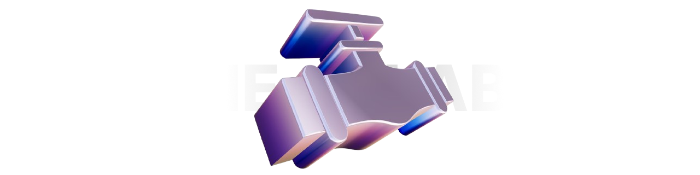
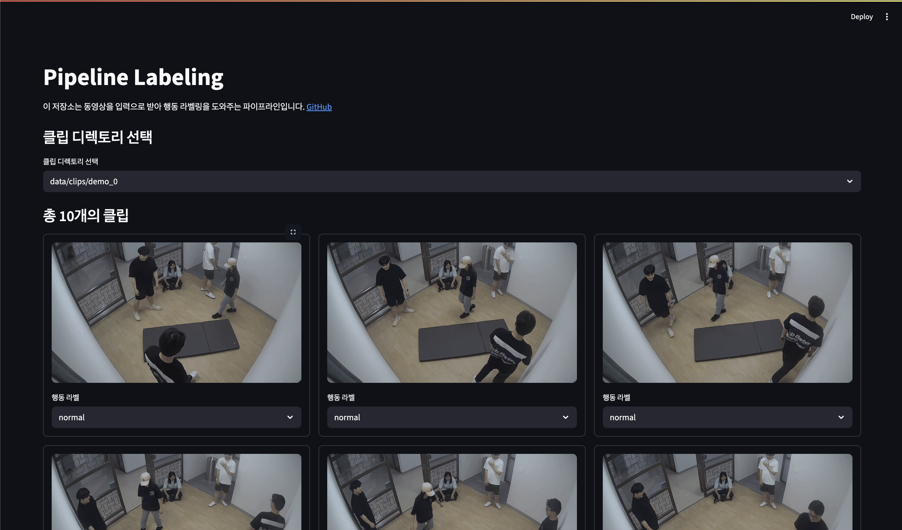

# Pipeline Labeling

이 저장소는 동영상을 입력으로 받아 행동 라벨링을 도와주는 파이프라인입니다.

### Note

모든 테스트는 다음 환경에서 진행되었습니다. 일부 환경에서는 버전 호환성 확인이 필요할 수 있습니다.

    CPU: Intel(R) Core(TM) i9-13900KF
    GPU: Nvidia GeForce RTX 4090, CUDA 12.1
    OS: Ubuntu 24.04 LTS
    Conda: 25.5.1

## Installation

이 저장소에서 제공하는 모듈을 실행하기 위해 Conda 기반 환경을 구성합니다.

만약, Conda가 설치되어 있지 않다면 아래 링크에 접속하여 설치 후 단계를 진행합니다.

[🔗 아나콘다 다운로드](https://www.anaconda.com/download/success) 또는 [🔗 미니콘다 다운로드](https://www.anaconda.com/docs/getting-started/miniconda/main)

**Step 1**. Conda 가상환경 생성 및 활성화

```bash
conda create --name ngc-pipe-label python=3.9 -y
conda activate ngc-pipe-label
```

**Step 2**. 라이브러리 설치

```bash
pip install -r requirements.txt
```

## Preparation

이 모듈을 통해 마스킹 및 분리할 동영상 파일을 준비합니다. (`.mp4`, `.avi`, `.mov` 확장자의 동영상을 지원합니다.)

준비된 동영상을 `data/videos` 디렉토리에 위치시킵니다.

## Run

```bash
bash run.sh
```

또는

```bash
python func.py
streamlit run app.py
```

이후, 터미널에 표시되는 URL롤 접속하여 라벨값을 조정합니다.



작업 중 오류가 발생하여 다시 작업을 이어 진행하려면 아래 명령어를 입력합니다.

```bash
streamlit run app.py
```

라벨링 작업을 완료한 후, 터미널에서 `ctrl + c` 를 입력하여 웹 UI를 종료합니다.

라벨링 `csv`파일을 얻기 위해 아래 명령어를 실행합니다.

```bash
python compose.py
```

이 모듈에서 생성된 `data/output` 디렉토리는, [`Pipe-Action`](https://github.com/DGU-NEXT-GEN-CCTV/Pipe-Action) 모듈에서 입력값으로 사용됩니다.
